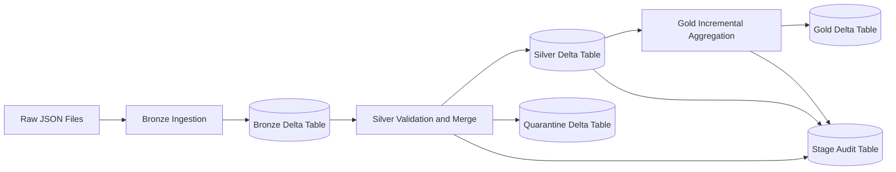
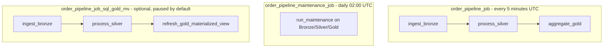
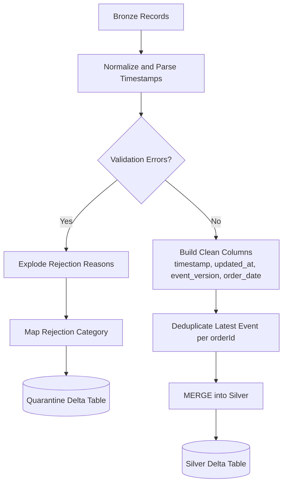
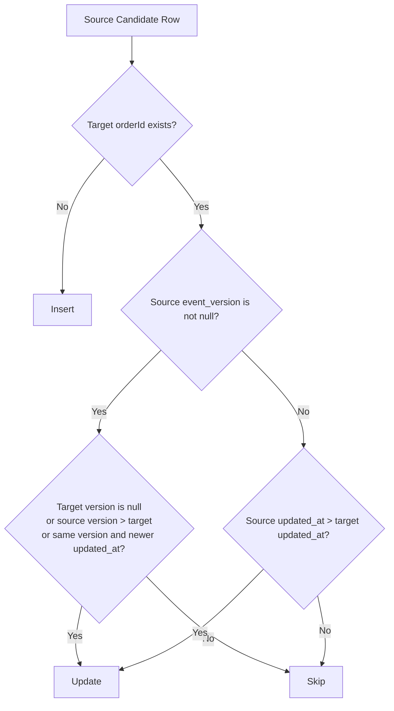
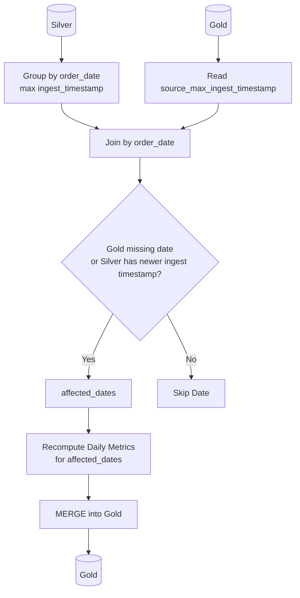
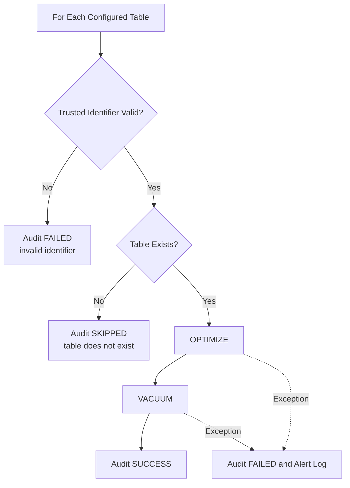

# Databricks Order Pipeline

This document describes the project structure, runtime flow, local and Databricks execution, data quality rules, operational policies, security constraints, and every application property / Databricks Asset Bundle variable used by this repository.

## 1. Overview

This project is a Spring Boot 3.3 / Java 17 command-line application that runs an order data pipeline on Apache Spark and Delta Lake, primarily targeting Databricks.

The pipeline follows a Medallion-style architecture:

- **Bronze**: ingest raw JSON order events into a Delta table.
- **Silver**: validate schema and business rules, split valid and invalid records, and merge the latest mutable order state into Silver.
- **Gold**: incrementally aggregate daily metrics from Silver and merge them into Gold.
- **Quarantine**: store invalid records with rejection reasons and categories.
- **Stage audit**: record input/output/rejected/rescued counts for Bronze, Silver, and Gold.
- **Maintenance audit**: record best-effort `OPTIMIZE` / `VACUUM` outcomes.

Main technologies:

- Java 17
- Spring Boot 3.3
- Apache Spark 3.5
- Delta Lake 3.1
- Databricks Asset Bundles
- Maven Shade Plugin for producing a Databricks-compatible JAR

## 2. Project Structure

```text
.
├── databricks.yml
├── pom.xml
├── README.md
├── README_Vie.md
├── orders.json
├── orders1.json
├── resources
│   ├── jobs.yml
│   ├── jobs_sql_mv.yml
│   └── sql
│       └── gold_daily_metrics_mv.sql
└── src
    ├── main
    │   ├── java/com/company/orderpipeline
    │   │   ├── OrderPipelineApplication.java
    │   │   ├── config/SparkConfig.java
    │   │   └── service/OrderTransformationService.java
    │   └── resources
    │       ├── application.properties
    │       ├── application-local.properties
    │       └── application-prod.properties
    └── test/java/com/company/orderpipeline/service
        └── OrderTransformationServiceTest.java
```

### 2.1. Important Files

| File | Purpose |
|---|---|
| `pom.xml` | Maven dependencies, Java/Spark/Delta versions, and Maven Shade Plugin configuration. |
| `databricks.yml` | Databricks Asset Bundle root config, variables, and targets (`dev`, `prod`, `prod_sql_mv`). |
| `resources/jobs.yml` | Main Databricks jobs: Bronze -> Silver -> Gold and a separate Maintenance job. |
| `resources/jobs_sql_mv.yml` | Alternative Databricks job: Bronze -> Silver -> SQL materialized-view Gold. |
| `resources/sql/gold_daily_metrics_mv.sql` | SQL for the Gold daily metrics materialized view. |
| `OrderPipelineApplication.java` | Spring Boot entrypoint; dispatches stages (`bronze`, `silver`, `gold`, `maintenance`, `all`). |
| `SparkConfig.java` | Creates or attaches to a `SparkSession`. Local can use `spark.master`; Databricks uses the active session. |
| `OrderTransformationService.java` | Core implementation for Bronze, Silver, Gold, maintenance, audit, validation, alerts, and table-name validation. |
| `application.properties` | Default application properties. |
| `application-local.properties` | Local/test profile overrides. |
| `application-prod.properties` | Production profile overrides. |
| `OrderTransformationServiceTest.java` | Unit/integration tests for cleaning, Silver, Gold, maintenance, validation, and trusted identifiers. |
| `orders.json`, `orders1.json` | Sample local input data. |

## 3. Runtime Flow

The application reads the first command-line argument as the stage name:

```text
bronze | silver | gold | maintenance | all
```

If no stage is passed, the default stage is `all`.

The `all` flow is:

```text
1. Bronze
   Raw JSON files
   -> Spark JSON reader or Databricks Auto Loader
   -> Bronze Delta table

2. Silver
   Bronze Delta table
   -> normalize + validate
   -> valid records
   -> deduplicate latest event per orderId
   -> merge into Silver Delta table
   -> invalid records into Quarantine Delta table
   -> write Stage Audit

3. Gold
   Silver Delta table
   -> identify affected order_date values
   -> recompute daily metrics only for those dates
   -> merge into Gold Delta table
   -> write Stage Audit

4. Maintenance
   Bronze/Silver/Gold tables
   -> best-effort OPTIMIZE/VACUUM
   -> write Maintenance Audit
```

On Databricks, `resources/jobs.yml` schedules Bronze/Silver/Gold every 5 minutes and splits Maintenance into a separate daily job.

### 3.1. Mermaid Execution Diagrams

#### End-to-End Data Flow



#### Databricks Job Orchestration



#### Silver Record Lifecycle



#### Mutable Order Merge Decision



#### Gold Incremental Refresh Logic



#### Maintenance Best-Effort Flow



## 4. Bronze Stage

The Bronze stage reads raw JSON order events and writes them to a Delta table.

Supported ingestion modes:

| Mode | Reader | Intended Use |
|---|---|---|
| `cloudFiles` | `.readStream().format("cloudFiles")` | Databricks Runtime / production Auto Loader. |
| `json` | `.readStream().format("json")` | Local or test runs without Auto Loader. |

Mode config:

```properties
pipeline.ingestion.mode=cloudFiles
```

The local profile uses:

```properties
pipeline.ingestion.mode=json
```

Bronze order-event schema:

- `orderId`: string
- `customerId`: string
- `amount`: double
- `timestamp`: string event timestamp
- `updatedAt`: string source update timestamp
- `eventVersion`: long source event/order version

Auto Loader uses rescue mode and writes rescued data to `_rescued_data`. Local JSON permissive mode writes corrupt records to `_corrupt_record`.

## 5. Silver Stage

The Silver stage validates every Bronze record, writes invalid records to quarantine, and merges the latest valid order state into Silver.

### 5.1. Validation Rules

The service normalizes and validates the following:

- Trims `orderId`, `customerId`, `timestamp`, and `updatedAt`.
- `orderId` must not be null or blank.
- `customerId` must not be null or blank.
- `amount` is required and must be greater than `0`.
- `timestamp` is required and must parse to a supported timestamp format.
- `updatedAt`, when present, must parse to a supported timestamp format.
- `eventVersion`, when present, must be greater than or equal to `0`.
- `_rescued_data` must not be present.
- `_corrupt_record` must not be present.

Supported timestamp formats:

```text
yyyy-MM-dd'T'HH:mm:ss.SSSX
yyyy-MM-dd'T'HH:mm:ssX
yyyy-MM-dd'T'HH:mm:ss
yyyy-MM-dd HH:mm:ss
yyyy-MM-dd
```

### 5.2. Mutable Order Contract

Orders can be updated, so Silver needs deterministic ordering to prevent stale events from rolling back newer order state.

Update-ordering fields:

- `updatedAt`: source-side time when the order was updated.
- `eventVersion`: monotonic source version for the order/event.

Contract flags:

```properties
pipeline.contract.require-updated-at=true
pipeline.contract.require-event-version=true
```

Production profile enables both flags. Local profile disables both to keep local/test and legacy data flexible.

Behavior:

- If `pipeline.contract.require-updated-at=true` and `updatedAt` is missing, the record is quarantined with `MISSING_UPDATED_AT`.
- If `pipeline.contract.require-event-version=true` and `eventVersion` is missing, the record is quarantined with `MISSING_EVENT_VERSION`.
- If `pipeline.contract.require-updated-at=false`, missing `updatedAt` falls back to event `timestamp` as `updated_at`.
- If `pipeline.contract.require-event-version=false`, missing `eventVersion` is accepted.

### 5.3. Valid and Invalid Records

After validation:

- Valid records become clean Silver candidates.
- Invalid records are appended to the quarantine table.

Clean Silver output keeps:

- `orderId`
- `customerId`
- `amount`
- `timestamp`: parsed event timestamp, preserving full date and time.
- `updated_at`: parsed update timestamp.
- `event_version`: source event version.
- `order_date`: date key for daily aggregation.
- `ingest_timestamp`: Bronze ingest timestamp.

### 5.4. Quarantine Records

Invalid records are written to `pipeline.orders.quarantine.table`.

If a record violates multiple rules, quarantine stores one row per `rejection_reason`.

Common `rejection_reason` values:

| Reason | Meaning |
|---|---|
| `MISSING_ORDER_ID` | Missing or blank `orderId`. |
| `MISSING_CUSTOMER_ID` | Missing or blank `customerId`. |
| `MISSING_AMOUNT` | Missing `amount`. |
| `NON_POSITIVE_AMOUNT` | `amount <= 0`. |
| `MISSING_TIMESTAMP` | Missing `timestamp`. |
| `INVALID_TIMESTAMP` | `timestamp` cannot be parsed. |
| `MISSING_UPDATED_AT` | Missing `updatedAt` while required by contract config. |
| `INVALID_UPDATED_AT` | `updatedAt` cannot be parsed. |
| `MISSING_EVENT_VERSION` | Missing `eventVersion` while required by contract config. |
| `INVALID_EVENT_VERSION` | `eventVersion < 0`. |
| `RESCUED_DATA_PRESENT` | Auto Loader rescued data is present. |
| `CORRUPT_RECORD` | Local JSON corrupt record is present. |

`rejection_category` values:

| Category | Meaning |
|---|---|
| `SCHEMA` | Missing/invalid required fields, timestamp parse failure, invalid event version, or required contract field missing. |
| `BUSINESS_RULE` | Domain rule violation such as non-positive amount. |
| `INGESTION` | Auto Loader rescued data or local corrupt JSON records. |
| `UNKNOWN` | Fallback for unmapped reasons. |

### 5.5. Silver Merge Semantics

Before merging, records in the same batch are deduplicated by `orderId`. The latest event is selected by:

```text
updated_at DESC,
event_version DESC NULLS LAST,
ingest_timestamp DESC NULLS LAST,
timestamp DESC
```

Silver merge behavior:

- Insert if `orderId` does not exist in Silver.
- Update only when the source event is newer than the target:
  - source has `event_version` and it is greater than target version; or
  - versions are equal and source `updated_at` is newer; or
  - source has no version and source `updated_at` is newer.

This prevents late-arriving stale updates from overwriting current Silver state.

If an existing Silver table does not have `updated_at` or `event_version`, the pipeline adds those columns automatically and backfills `updated_at` from `timestamp` / `ingest_timestamp`.

## 6. Gold Stage

The Gold stage builds daily metrics from Silver.

Gold output columns:

- `order_date`
- `totalOrders`
- `totalRevenue`
- `source_max_ingest_timestamp`
- `gold_updated_at`

Important behavior:

- Gold is a daily aggregate, so the key is `order_date`, not full event `timestamp`.
- `timestamp` stays as the original event timestamp in Silver.
- Gold recomputes only affected dates, not the entire historical table.
- Recomputed daily metrics are merged into Gold by `order_date`.
- On first creation, Gold is partitioned by `order_date`.

Affected date logic:

- Group Silver by `order_date` and compute `max(ingest_timestamp)`.
- Compare that state to Gold `source_max_ingest_timestamp`.
- Recompute dates that are new or have newer Silver data.

## 7. SQL Materialized View Option

The repository also includes an optional Databricks SQL Gold materialized-view job.

SQL file:

```text
resources/sql/gold_daily_metrics_mv.sql
```

Job file:

```text
resources/jobs_sql_mv.yml
```

Flow:

```text
Bronze Spark task -> Silver Spark task -> SQL task refresh/create Gold MV
```

Required bundle variables:

- `sql_warehouse_id`
- `silver_table_name`
- `gold_materialized_view_name`

The SQL-MV job is paused by default to avoid accidental activation.

## 8. Stage Metrics, Audit, and Alerts

Each data stage emits a summary with:

- `input_records`
- `output_records`
- `rejected_records`
- `rescued_records`
- `status`
- `details`

Audit table config:

```properties
pipeline.stage.audit.table=workspace.sales.stage_audit
```

Alert rules:

- Alert if `input_records > 0` and `output_records = 0`.
- Alert if `output_records / input_records` is below `pipeline.stage.alert.min-output-ratio`.
- Alert if `rejected_records` exceeds `pipeline.stage.alert.max-rejected-count`.

Config:

```properties
pipeline.stage.alert.on-anomaly=true
pipeline.stage.alert.min-output-ratio=0.1
pipeline.stage.alert.max-rejected-count=1000
```

Alerts are currently emitted as logs with the `ALERT: ...` prefix. External monitoring should route those logs to Slack, email, PagerDuty, or another incident channel if needed.

## 9. Maintenance Stage

Maintenance is best-effort:

- The pipeline does not fail only because maintenance fails.
- Maintenance has separate audit rows.
- Maintenance emits separate alert logs on failure or suspected permission issues.

Maintenance runs:

```sql
OPTIMIZE <table>
VACUUM <table> RETAIN <hours> HOURS
```

Retention config:

```properties
pipeline.maintenance.vacuum-retention-hours=168
pipeline.maintenance.audit-replay-required=true
pipeline.maintenance.slow-downstream-max-lag-hours=24
```

Current policy:

- Production keeps at least 7 days (`168` hours) of time travel.
- Audit/replay requirement is enabled by default in production.
- Slow downstream readers are assumed to lag by up to 24 hours.
- Maintenance runs in a separate daily job at `02:00 UTC`; it does not run every 5 minutes.

If configured retention is below the required policy window, the pipeline logs `Maintenance retention policy risk`.

## 10. Trusted Table Names and SQL Identifier Safety

Table names are treated as trusted configuration, not arbitrary external input.

Current guards:

- Core Medallion table names cannot be overridden directly through command-line args:
  - `--pipeline.orders.bronze.table=...`
  - `--pipeline.orders.silver.table=...`
  - `--pipeline.orders.gold.table=...`
  - `--pipeline.orders.quarantine.table=...`
- Runtime table names are validated before use.
- Valid format: 1 to 3 dot-separated identifier parts. Each part must start with a letter or underscore and may contain only letters, digits, and underscores.
- Valid examples:
  - `bronze_orders`
  - `sales.bronze_orders`
  - `workspace.sales.bronze_orders`
- Invalid examples:
  - `workspace.sales.bronze-orders`
  - `workspace.sales.orders;DROP TABLE x`
  - ``workspace.sales.`orders` ``
- SQL statements that need identifiers (`ALTER TABLE`, `UPDATE`, `OPTIMIZE`, `VACUUM`) quote validated identifiers with backticks.
- Invalid maintenance table identifiers are audited as `FAILED` and are never executed.

If your team needs table names with special characters, expand the allowlist deliberately instead of accepting arbitrary identifiers.

## 11. Local Development and Testing

### 11.1. Prerequisites

- Java 17
- Maven 3.6+
- Spark dependencies downloaded by Maven for local tests
- On Windows, some Delta integration tests need `HADOOP_HOME` / `winutils`; the test suite skips those cases when the requirement is missing.

### 11.2. Build

```bash
mvn clean package
```

JAR output:

```text
target/orderpipeline-0.0.1-SNAPSHOT.jar
```

### 11.3. Compile Only

```bash
mvn -q -DskipTests compile
```

### 11.4. Run Tests

```bash
mvn -q -Dtest=OrderTransformationServiceTest test
```

### 11.5. Run Bronze Locally

Prepare a local raw input directory, for example:

```text
./data/raw/orders.json
```

Because the application rejects direct CLI overrides for core table names, configure local table names in `application-local.properties` or another trusted local profile instead of passing them as command-line args.

Example local trusted config:

```properties
pipeline.orders.raw.dir=./data/raw
pipeline.orders.bronze.table=default.bronze_orders_local
pipeline.orders.silver.table=default.silver_orders_local
pipeline.orders.gold.table=default.gold_daily_metrics_local
pipeline.orders.quarantine.table=default.quarantine_orders_local
pipeline.checkpoint.bronze=./target/checkpoints/bronze
pipeline.ingestion.mode=json
```

Then run Bronze:

```bash
mvn spring-boot:run \
  -Dspring-boot.run.profiles=local \
  -Dspring-boot.run.arguments="bronze"
```

### 11.6. Run Individual Stages Locally

```bash
# Bronze
mvn spring-boot:run -Dspring-boot.run.profiles=local -Dspring-boot.run.arguments="bronze"

# Silver
mvn spring-boot:run -Dspring-boot.run.profiles=local -Dspring-boot.run.arguments="silver"

# Gold
mvn spring-boot:run -Dspring-boot.run.profiles=local -Dspring-boot.run.arguments="gold"

# Maintenance
mvn spring-boot:run -Dspring-boot.run.profiles=local -Dspring-boot.run.arguments="maintenance"

# All stages
mvn spring-boot:run -Dspring-boot.run.profiles=local -Dspring-boot.run.arguments="all"
```

## 12. Deploy and Run on Databricks

### 12.1. Prerequisites

- Databricks CLI is installed and authenticated.
- `databricks.yml` points to the correct workspace host.
- The shaded JAR is built and uploaded to the path used by the jobs:

```text
/Volumes/workspace/sales/artifacts/orderpipeline-0.0.1-SNAPSHOT.jar
```

### 12.2. Validate Bundle

```bash
databricks bundle validate
```

Or validate a specific target:

```bash
databricks bundle validate -t prod
```

### 12.3. Deploy Dev

```bash
databricks bundle deploy
```

### 12.4. Run Dev Job

```bash
databricks bundle run order_pipeline_job
```

### 12.5. Deploy and Run Production

```bash
databricks bundle deploy -t prod
databricks bundle run -t prod order_pipeline_job
```

### 12.6. Run Maintenance Job

```bash
databricks bundle run -t prod order_pipeline_maintenance_job
```

### 12.7. Deploy and Run SQL Materialized View Alternative

```bash
databricks bundle deploy -t prod_sql_mv
databricks bundle run -t prod_sql_mv order_pipeline_job_sql_gold_mv
```

Set these first:

```powershell
$env:DATABRICKS_BUNDLE_VAR_sql_warehouse_id="<your-sql-warehouse-id>"
$env:DATABRICKS_BUNDLE_VAR_silver_table_name="workspace.sales.silver_orders"
$env:DATABRICKS_BUNDLE_VAR_gold_materialized_view_name="workspace.sales.gold_daily_metrics_mv"
```

## 13. Databricks Jobs

### 13.1. `order_pipeline_job`

Defined in `resources/jobs.yml`.

Schedule:

```text
0 0/5 * * * ?  (every 5 minutes, UTC)
```

Tasks:

1. `ingest_bronze`
2. `process_silver`, depends on `ingest_bronze`
3. `aggregate_gold`, depends on `process_silver`

### 13.2. `order_pipeline_maintenance_job`

Defined in `resources/jobs.yml`.

Schedule:

```text
0 0 2 * * ?  (daily at 02:00 UTC)
```

Task:

- `run_maintenance`

### 13.3. `order_pipeline_job_sql_gold_mv`

Defined in `resources/jobs_sql_mv.yml`.

Default schedule state:

```yaml
pause_status: PAUSED
```

Tasks:

1. `ingest_bronze`
2. `process_silver`
3. `refresh_gold_materialized_view`

## 14. Complete Application Properties

### 14.1. Spring Properties

| Property | Current Default | Required | Description |
|---|---:|---|---|
| `spring.application.name` | `orderpipeline` | Yes | Spring application name. |
| `spring.main.web-application-type` | `none` | Yes | Disables the web server because this is a batch/CLI application. |

### 14.2. Pipeline Table and Path Properties

| Property | Current Default | Required | Description |
|---|---:|---|---|
| `pipeline.orders.raw.dir` | `/Volumes/workspace/sales/raw/` | Yes | Raw JSON input path. Databricks should use a Volume path. |
| `pipeline.orders.bronze.table` | `workspace.sales.bronze_orders` | Yes | Bronze Delta table. Trusted config only. |
| `pipeline.orders.silver.table` | `workspace.sales.silver_orders` | Yes | Silver Delta table. Trusted config only. |
| `pipeline.orders.gold.table` | `workspace.sales.gold_daily_metrics` | Yes | Gold Delta table. Trusted config only. |
| `pipeline.orders.quarantine.table` | `workspace.sales.quarantine_orders` | Yes | Invalid-record quarantine table. Trusted config only. |
| `pipeline.checkpoint.bronze` | `/Volumes/workspace/sales/artifacts/checkpoints/bronze/` | Yes | Checkpoint path for Bronze Structured Streaming / Auto Loader. |

### 14.3. Ingestion Properties

| Property | Current Default | Valid Values | Description |
|---|---:|---|---|
| `pipeline.ingestion.mode` | `cloudFiles` | `cloudFiles`, `json` | `cloudFiles` for Databricks Auto Loader; `json` for local/test. |

### 14.4. Production and Data Quality Properties

| Property | Current Default | Description |
|---|---:|---|
| `pipeline.production.mode` | `false` | Enables production behavior, such as failing Silver when rescued/corrupt records exceed threshold. |
| `pipeline.alert.rescued-record-threshold` | `100` | Rescued/corrupt record threshold. If production mode is enabled and the count exceeds this, Silver fails. |
| `pipeline.contract.require-updated-at` | `false` | Requires `updatedAt`. Production profile sets this to `true`. |
| `pipeline.contract.require-event-version` | `false` | Requires `eventVersion`. Production profile sets this to `true`. |

### 14.5. Stage Observability Properties

| Property | Current Default | Description |
|---|---:|---|
| `pipeline.stage.audit.table` | `workspace.sales.stage_audit` | Delta table for stage audit rows. Empty disables stage audit writes. |
| `pipeline.stage.alert.on-anomaly` | `true` | Enables/disables stage anomaly alert logs. |
| `pipeline.stage.alert.min-output-ratio` | `0.1` | Minimum output/input ratio before alerting. |
| `pipeline.stage.alert.max-rejected-count` | `1000` | Maximum rejected records before alerting. |

### 14.6. Maintenance Properties

| Property | Current Default | Description |
|---|---:|---|
| `pipeline.maintenance.audit.table` | `workspace.sales.maintenance_audit` | Delta table for maintenance audit rows. Empty disables maintenance audit writes. |
| `pipeline.maintenance.alert.on-failure` | `true` | Enables/disables maintenance failure alert logs. |
| `pipeline.maintenance.vacuum-retention-hours` | `168` | Retention used for `VACUUM RETAIN <hours> HOURS`. |
| `pipeline.maintenance.audit-replay-required` | `true` | If true, policy requires at least 168 hours of retention. |
| `pipeline.maintenance.slow-downstream-max-lag-hours` | `24` | Maximum downstream reader lag used when evaluating retention risk. |

### 14.7. Local Spark Properties

| Property | Current Default | Description |
|---|---:|---|
| `spark.master` | `local[*]` | Spark master for local runs. Usually not needed in Databricks. |
| `spark.app.name` | `OrderPipelineLocal` | Spark application name. |

## 15. Profile-Specific Properties

### 15.1. `application.properties`

```properties
spring.application.name=orderpipeline
spring.main.web-application-type=none
pipeline.orders.raw.dir=/Volumes/workspace/sales/raw/
pipeline.orders.bronze.table=workspace.sales.bronze_orders
pipeline.orders.silver.table=workspace.sales.silver_orders
pipeline.orders.gold.table=workspace.sales.gold_daily_metrics
pipeline.orders.quarantine.table=workspace.sales.quarantine_orders
pipeline.checkpoint.bronze=/Volumes/workspace/sales/artifacts/checkpoints/bronze/
pipeline.ingestion.mode=cloudFiles
pipeline.production.mode=false
pipeline.alert.rescued-record-threshold=100
pipeline.contract.require-updated-at=false
pipeline.contract.require-event-version=false
pipeline.stage.audit.table=workspace.sales.stage_audit
pipeline.stage.alert.on-anomaly=true
pipeline.stage.alert.min-output-ratio=0.1
pipeline.stage.alert.max-rejected-count=1000
pipeline.maintenance.audit.table=workspace.sales.maintenance_audit
pipeline.maintenance.alert.on-failure=true
pipeline.maintenance.vacuum-retention-hours=168
pipeline.maintenance.audit-replay-required=true
pipeline.maintenance.slow-downstream-max-lag-hours=24
spark.master=local[*]
spark.app.name=OrderPipelineLocal
```

### 15.2. `application-local.properties`

```properties
pipeline.ingestion.mode=json
pipeline.production.mode=false
pipeline.contract.require-updated-at=false
pipeline.contract.require-event-version=false
pipeline.orders.quarantine.table=default.quarantine_orders_local
pipeline.stage.audit.table=default.stage_audit_local
pipeline.stage.alert.on-anomaly=true
pipeline.stage.alert.min-output-ratio=0.1
pipeline.stage.alert.max-rejected-count=1000
pipeline.maintenance.audit.table=default.maintenance_audit_local
pipeline.maintenance.alert.on-failure=true
pipeline.maintenance.vacuum-retention-hours=168
pipeline.maintenance.audit-replay-required=true
pipeline.maintenance.slow-downstream-max-lag-hours=24
```

### 15.3. `application-prod.properties`

```properties
pipeline.production.mode=true
pipeline.alert.rescued-record-threshold=50
pipeline.contract.require-updated-at=true
pipeline.contract.require-event-version=true
pipeline.maintenance.vacuum-retention-hours=168
pipeline.maintenance.audit-replay-required=true
pipeline.maintenance.slow-downstream-max-lag-hours=24
```

## 16. Databricks Asset Bundle Variables

Variables in `databricks.yml`:

| Variable | Default | Description |
|---|---:|---|
| `sql_warehouse_id` | `REPLACE_WITH_SQL_WAREHOUSE_ID` | SQL Warehouse ID for the SQL materialized-view job. |
| `silver_table_name` | `workspace.sales.silver_orders` | Silver table used by the SQL MV. |
| `gold_materialized_view_name` | `workspace.sales.gold_daily_metrics_mv` | Gold materialized view name. |
| `maintenance_vacuum_retention_hours` | `168` | VACUUM retention in hours. |
| `maintenance_audit_replay_required` | `true` | Whether audit/replay is required. |
| `maintenance_slow_downstream_max_lag_hours` | `24` | Maximum downstream lag in hours. |
| `maintenance_audit_table` | `workspace.sales.maintenance_audit` | Maintenance audit table. |
| `maintenance_alert_on_failure` | `true` | Enables maintenance failure alert logs. |
| `stage_audit_table` | `workspace.sales.stage_audit` | Stage audit table. |
| `stage_alert_on_anomaly` | `true` | Enables stage anomaly alert logs. |
| `stage_alert_min_output_ratio` | `0.1` | Minimum output/input ratio. |
| `stage_alert_max_rejected_count` | `1000` | Maximum rejected count. |
| `contract_require_updated_at` | `true` | Whether `updatedAt` is required. |
| `contract_require_event_version` | `true` | Whether `eventVersion` is required. |

Override examples:

```powershell
$env:DATABRICKS_BUNDLE_VAR_stage_audit_table="workspace.sales.stage_audit_custom"
$env:DATABRICKS_BUNDLE_VAR_contract_require_updated_at="true"
$env:DATABRICKS_BUNDLE_VAR_contract_require_event_version="false"
$env:DATABRICKS_BUNDLE_VAR_maintenance_vacuum_retention_hours="336"
```

## 17. Bundle Targets

### 17.1. `dev`

| Variable | Value |
|---|---:|
| `maintenance_vacuum_retention_hours` | `72` |
| `maintenance_audit_replay_required` | `false` |
| `maintenance_slow_downstream_max_lag_hours` | `6` |
| `maintenance_audit_table` | `workspace.sales.maintenance_audit_dev` |
| `maintenance_alert_on_failure` | `true` |
| `stage_audit_table` | `workspace.sales.stage_audit_dev` |
| `stage_alert_on_anomaly` | `true` |
| `stage_alert_min_output_ratio` | `0.05` |
| `stage_alert_max_rejected_count` | `5000` |
| `contract_require_updated_at` | `false` |
| `contract_require_event_version` | `false` |

### 17.2. `prod`

| Variable | Value |
|---|---:|
| `maintenance_vacuum_retention_hours` | `168` |
| `maintenance_audit_replay_required` | `true` |
| `maintenance_slow_downstream_max_lag_hours` | `24` |
| `maintenance_audit_table` | `workspace.sales.maintenance_audit` |
| `maintenance_alert_on_failure` | `true` |
| `stage_audit_table` | `workspace.sales.stage_audit` |
| `stage_alert_on_anomaly` | `true` |
| `stage_alert_min_output_ratio` | `0.1` |
| `stage_alert_max_rejected_count` | `1000` |
| `contract_require_updated_at` | `true` |
| `contract_require_event_version` | `true` |

### 17.3. `prod_sql_mv`

Same policy defaults as `prod`, but uses the SQL materialized-view alternative job.

## 18. Sample Input Data

Valid order-event example:

```json
{
  "orderId": "o1",
  "customerId": "c1",
  "amount": 100000,
  "timestamp": "2026-05-12T10:00:00Z",
  "updatedAt": "2026-05-12T10:05:00Z",
  "eventVersion": 1
}
```

Meaning:

- `timestamp`: event/order timestamp; used to derive `order_date`.
- `updatedAt`: source update timestamp; used for mutable-order ordering.
- `eventVersion`: monotonic source version; should increase for each `orderId` update.

## 19. Production Readiness Checklist

- Unity Catalog catalog/schema/volume exists.
- `pipeline.orders.raw.dir` exists and the job can read it.
- `pipeline.checkpoint.bronze` exists or the job can create it.
- Delta table names follow the trusted identifier format.
- Production flags are set:
  - `pipeline.production.mode=true`
  - `pipeline.contract.require-updated-at=true`
  - `pipeline.contract.require-event-version=true`
- Monitoring routes `ALERT: ...` logs to the right incident channel.
- Job has write access to stage audit, quarantine, and maintenance audit tables.
- Maintenance job has `OPTIMIZE` / `VACUUM` permissions if successful maintenance is expected.
- `pipeline.maintenance.vacuum-retention-hours` satisfies time travel, audit/replay, and downstream lag requirements.
- If using SQL MV, `sql_warehouse_id` is set and the warehouse has permission to read Silver and write/refresh the MV.

## 20. Troubleshooting

| Symptom | Common Cause | Check / Fix |
|---|---|---|
| Bronze reads no files | Wrong raw dir or ingestion mode | Check `pipeline.orders.raw.dir` and `pipeline.ingestion.mode`. Use `json` locally and `cloudFiles` on Databricks. |
| Silver has no output | All records are rejected | Inspect quarantine and stage audit `rejected_records`. |
| Quarantine has `MISSING_UPDATED_AT` | Contract requires `updatedAt` | Add the field from source or temporarily set `pipeline.contract.require-updated-at=false` for phased rollout. |
| Quarantine has `MISSING_EVENT_VERSION` | Contract requires `eventVersion` | Add source versioning or temporarily set `pipeline.contract.require-event-version=false`. |
| Gold does not refresh | No affected dates detected | Check Silver `ingest_timestamp` and Gold `source_max_ingest_timestamp`. |
| Maintenance fails | Missing privilege or table does not exist | Inspect `maintenance_audit` and `ALERT: Maintenance ...` logs. |
| Table name is rejected | Identifier does not match trusted format | Use letters/digits/underscore only, with up to three dot-separated parts. |
| Bundle validation fails | Workspace host, variable, or job config issue | Run `databricks bundle validate -t <target>` and inspect `databricks.yml`. |

## 21. Common Validation Commands

```bash
# Compile
mvn -q -DskipTests compile

# Test service
mvn -q -Dtest=OrderTransformationServiceTest test

# Build JAR
mvn clean package

# Validate Databricks bundle
databricks bundle validate --profile DEFAULT

# Deploy dev
databricks bundle deploy

# Run dev job
databricks bundle run order_pipeline_job
```
