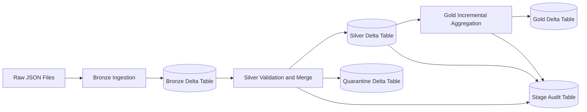
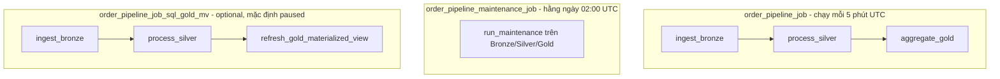
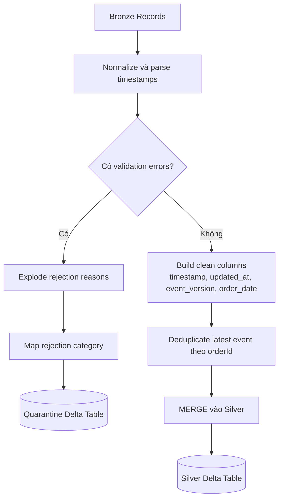
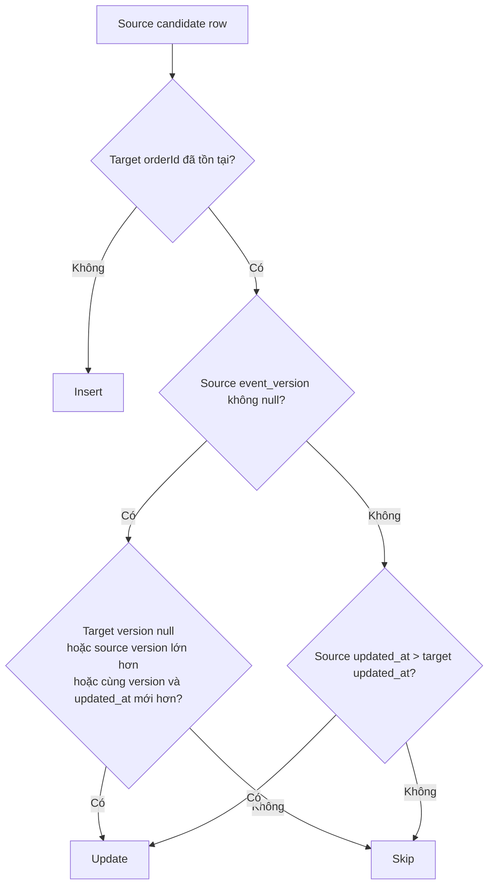
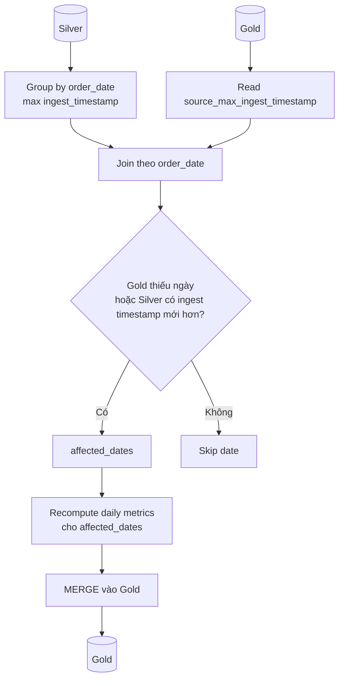
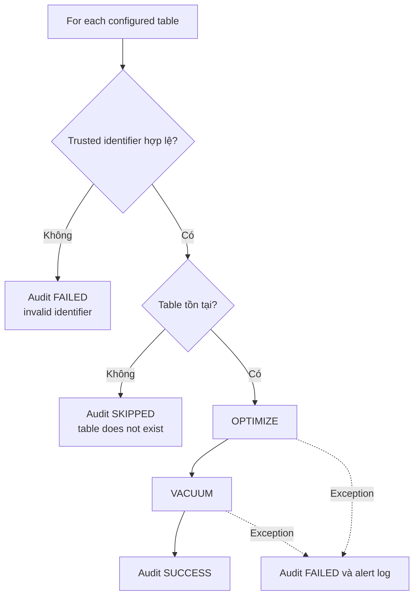

# Databricks Order Pipeline - Tài liệu tiếng Việt

Tài liệu này mô tả chi tiết cấu trúc dự án, cách chạy, luồng xử lý dữ liệu, cơ chế kiểm soát chất lượng, bảo trì, monitoring và toàn bộ property/variable cần cấu hình cho project `databricks-order-pipeline`.

## 1. Tổng quan

Project này là một pipeline xử lý dữ liệu đơn hàng theo kiến trúc Medallion trên Databricks/Spark/Delta Lake, được đóng gói như một Spring Boot command-line application.

Pipeline chính gồm các tầng:

- **Bronze**: đọc raw order event dạng JSON vào Delta table.
- **Silver**: validate schema/business rule, tách valid/invalid records, merge trạng thái order mới nhất vào Silver.
- **Gold**: aggregate daily metrics từ Silver và merge incremental vào Gold.
- **Quarantine**: lưu record lỗi kèm `rejection_reason` và `rejection_category`.
- **Stage audit**: ghi audit count input/output/rejected/rescued từng stage.
- **Maintenance audit**: ghi kết quả `OPTIMIZE`/`VACUUM` dạng best-effort.

Công nghệ chính:

- Java 17
- Spring Boot 3.3
- Apache Spark 3.5
- Delta Lake 3.1
- Databricks Asset Bundles
- Maven Shade Plugin để build JAR chạy trên Databricks

## 2. Cấu trúc dự án

```text
.
├── databricks.yml
├── pom.xml
├── README.md
├── README_Vie.md
├── orders.json
├── orders1.json
├── resources
│   ├── jobs.yml
│   ├── jobs_sql_mv.yml
│   └── sql
│       └── gold_daily_metrics_mv.sql
└── src
    ├── main
    │   ├── java/com/company/orderpipeline
    │   │   ├── OrderPipelineApplication.java
    │   │   ├── config/SparkConfig.java
    │   │   └── service/OrderTransformationService.java
    │   └── resources
    │       ├── application.properties
    │       ├── application-local.properties
    │       └── application-prod.properties
    └── test/java/com/company/orderpipeline/service
        └── OrderTransformationServiceTest.java
```

### 2.1. Các file quan trọng

| File | Vai trò |
|---|---|
| `pom.xml` | Khai báo dependency, Java/Spark/Delta version, cấu hình Maven Shade Plugin để tạo JAR. |
| `databricks.yml` | Databricks Asset Bundle root config, khai báo variables và targets `dev`, `prod`, `prod_sql_mv`. |
| `resources/jobs.yml` | Job Databricks chính: Bronze -> Silver -> Gold và job Maintenance riêng. |
| `resources/jobs_sql_mv.yml` | Job thay thế: Bronze -> Silver -> refresh Gold bằng SQL materialized view. |
| `resources/sql/gold_daily_metrics_mv.sql` | SQL tạo/refresh materialized view Gold daily metrics. |
| `OrderPipelineApplication.java` | Entrypoint Spring Boot, chọn stage chạy (`bronze`, `silver`, `gold`, `maintenance`, `all`). |
| `SparkConfig.java` | Tạo/attach `SparkSession`. Local có thể dùng `spark.master`; Databricks dùng session sẵn có. |
| `OrderTransformationService.java` | Toàn bộ logic ingest Bronze, process Silver, aggregate Gold, maintenance, audit, alert. |
| `application.properties` | Config mặc định. |
| `application-local.properties` | Override cho local/test. |
| `application-prod.properties` | Override cho production. |
| `OrderTransformationServiceTest.java` | Unit/integration tests cho cleaning, Silver, Gold, maintenance, validation. |
| `orders.json`, `orders1.json` | Dữ liệu mẫu local. |

## 3. Luồng chạy tổng thể

Ứng dụng nhận stage từ argument đầu tiên:

```text
bronze | silver | gold | maintenance | all
```

Nếu không truyền argument, mặc định là `all`.

Luồng `all`:

```text
1. Bronze
   Raw JSON files
   -> Spark reader / Auto Loader
   -> Bronze Delta table

2. Silver
   Bronze Delta table
   -> normalize + validate
   -> valid records
   -> dedupe latest event by orderId
   -> merge vào Silver Delta table
   -> invalid records vào Quarantine Delta table
   -> ghi Stage Audit

3. Gold
   Silver Delta table
   -> tìm order_date bị ảnh hưởng
   -> recompute daily metrics cho các ngày đó
   -> merge vào Gold Delta table
   -> ghi Stage Audit

4. Maintenance
   Bronze/Silver/Gold tables
   -> OPTIMIZE/VACUUM best-effort
   -> ghi Maintenance Audit
```

Trên Databricks, `resources/jobs.yml` tách maintenance thành job riêng chạy hằng ngày, còn Bronze/Silver/Gold chạy theo lịch 5 phút.

### 3.1. Các diagram Mermaid mô tả luồng thực thi

#### Luồng dữ liệu end-to-end



#### Orchestration job trên Databricks



#### Vòng đời record trong Silver



#### Quyết định merge cho mutable order



#### Luồng incremental refresh của Gold



#### Luồng maintenance best-effort



## 4. Bronze stage

Bronze stage đọc raw JSON và ghi vào Delta table.

Có 2 ingestion mode:

| Mode | Reader | Mục đích |
|---|---|---|
| `cloudFiles` | `.readStream().format("cloudFiles")` | Databricks production, dùng Auto Loader. |
| `json` | `.readStream().format("json")` | Local/test hoặc môi trường không có Auto Loader. |

Config chọn mode:

```properties
pipeline.ingestion.mode=cloudFiles
```

Local profile đang dùng:

```properties
pipeline.ingestion.mode=json
```

Bronze schema order event gồm:

- `orderId`: string
- `customerId`: string
- `amount`: double
- `timestamp`: string event time
- `updatedAt`: string update time
- `eventVersion`: long

Với Auto Loader, schema evolution mode là `rescue`, rescued data được đưa vào `_rescued_data`. Với JSON local permissive mode, corrupt record được đưa vào `_corrupt_record`.

## 5. Silver stage

Silver stage là phần quan trọng nhất của pipeline.

### 5.1. Validation

Record từ Bronze được normalize và validate:

- Trim `orderId`, `customerId`, `timestamp`, `updatedAt`.
- `orderId` không được null/blank.
- `customerId` không được null/blank.
- `amount` bắt buộc và phải `> 0`.
- `timestamp` bắt buộc và parse được theo các format hỗ trợ.
- `updatedAt` parse được nếu có.
- `eventVersion` nếu có thì phải `>= 0`.
- `_rescued_data` không được có.
- `_corrupt_record` không được có.

Các timestamp format hỗ trợ:

```text
yyyy-MM-dd'T'HH:mm:ss.SSSX
yyyy-MM-dd'T'HH:mm:ssX
yyyy-MM-dd'T'HH:mm:ss
yyyy-MM-dd HH:mm:ss
yyyy-MM-dd
```

### 5.2. Contract cho mutable order

Order có thể update, vì vậy Silver cần biết event nào mới hơn.

Các field update-ordering:

- `updatedAt`: thời điểm order được cập nhật ở source.
- `eventVersion`: version/tăng dần của event/order từ source.

Config điều khiển bắt buộc field:

```properties
pipeline.contract.require-updated-at=true
pipeline.contract.require-event-version=true
```

Trong production profile, cả hai đang bật. Trong local profile, cả hai đang tắt để tương thích dữ liệu cũ/test.

Behavior:

- Nếu `require-updated-at=true` và thiếu `updatedAt`, record bị quarantine với `MISSING_UPDATED_AT`.
- Nếu `require-event-version=true` và thiếu `eventVersion`, record bị quarantine với `MISSING_EVENT_VERSION`.
- Nếu `require-updated-at=false`, thiếu `updatedAt` thì `updated_at` fallback về event `timestamp`.
- Nếu `require-event-version=false`, thiếu `eventVersion` vẫn được chấp nhận.

### 5.3. Tách valid/invalid

Sau validation:

- Valid records -> clean Silver output.
- Invalid records -> quarantine table.

Silver output giữ các field chính:

- `orderId`
- `customerId`
- `amount`
- `timestamp`: event timestamp đã parse, giữ đầy đủ ngày giờ.
- `updated_at`: parsed update timestamp.
- `event_version`: version từ source.
- `order_date`: date dùng cho daily aggregation.
- `ingest_timestamp`: thời điểm ingest vào Bronze.

### 5.4. Quarantine/bad records

Invalid record được ghi vào `pipeline.orders.quarantine.table`.

Nếu một record vi phạm nhiều rule, quarantine sẽ có một dòng cho mỗi `rejection_reason`.

Các `rejection_reason` chính:

| Reason | Ý nghĩa |
|---|---|
| `MISSING_ORDER_ID` | Thiếu/blank `orderId`. |
| `MISSING_CUSTOMER_ID` | Thiếu/blank `customerId`. |
| `MISSING_AMOUNT` | Thiếu `amount`. |
| `NON_POSITIVE_AMOUNT` | `amount <= 0`. |
| `MISSING_TIMESTAMP` | Thiếu `timestamp`. |
| `INVALID_TIMESTAMP` | `timestamp` không parse được. |
| `MISSING_UPDATED_AT` | Thiếu `updatedAt` khi config yêu cầu. |
| `INVALID_UPDATED_AT` | `updatedAt` không parse được. |
| `MISSING_EVENT_VERSION` | Thiếu `eventVersion` khi config yêu cầu. |
| `INVALID_EVENT_VERSION` | `eventVersion < 0`. |
| `RESCUED_DATA_PRESENT` | Auto Loader rescue data xuất hiện. |
| `CORRUPT_RECORD` | JSON local corrupt record. |

Các `rejection_category`:

| Category | Ý nghĩa |
|---|---|
| `SCHEMA` | Thiếu/invalid required field, timestamp parse fail, invalid event version. |
| `BUSINESS_RULE` | Rule nghiệp vụ, ví dụ amount không dương. |
| `INGESTION` | Lỗi ingest/rescue/corrupt record. |
| `UNKNOWN` | Fallback nếu reason chưa map. |

### 5.5. Merge Silver cho mutable order

Trước khi merge, records trong cùng batch được dedupe theo `orderId`, chọn event mới nhất theo thứ tự:

```text
updated_at DESC,
event_version DESC NULLS LAST,
ingest_timestamp DESC NULLS LAST,
timestamp DESC
```

Khi merge vào Silver:

- Insert nếu `orderId` chưa tồn tại.
- Update nếu source mới hơn target:
  - source có `event_version` và version lớn hơn target; hoặc
  - version bằng nhau nhưng `updated_at` mới hơn; hoặc
  - source không có version và `updated_at` mới hơn target.

Nhờ đó event cũ/late-arriving stale update không overwrite trạng thái order mới.

Nếu Silver table cũ chưa có `updated_at` hoặc `event_version`, pipeline tự thêm cột và backfill `updated_at` từ `timestamp`/`ingest_timestamp`.

## 6. Gold stage

Gold stage tạo daily metrics từ Silver.

Output Gold theo `order_date`:

- `order_date`
- `totalOrders`
- `totalRevenue`
- `source_max_ingest_timestamp`
- `gold_updated_at`

Điểm quan trọng:

- Gold là daily aggregation, không group theo full event timestamp.
- `order_date` là key rõ ràng cho dashboard/reporting.
- Pipeline chỉ recompute các ngày bị ảnh hưởng, không full overwrite toàn bộ Gold.
- Kết quả daily metrics được merge vào Gold theo `order_date`.
- Khi Gold table được tạo lần đầu, table được partition theo `order_date`.

Cách xác định affected dates:

- Group Silver theo `order_date`, lấy `max(ingest_timestamp)`.
- So với Gold `source_max_ingest_timestamp`.
- Recompute ngày mới hoặc ngày có Silver mới hơn Gold.

## 7. SQL materialized view option

Ngoài Java Gold stage, project có lựa chọn Gold bằng Databricks SQL materialized view.

File SQL:

```text
resources/sql/gold_daily_metrics_mv.sql
```

Job thay thế:

```text
resources/jobs_sql_mv.yml
```

Luồng job này:

```text
Bronze Spark task -> Silver Spark task -> SQL task refresh/create Gold MV
```

Cần set các bundle variables:

- `sql_warehouse_id`
- `silver_table_name`
- `gold_materialized_view_name`

## 8. Stage audit, metric và alert

Pipeline ghi summary cho từng stage:

- `input_records`
- `output_records`
- `rejected_records`
- `rescued_records`
- `status`
- `details`

Audit table config:

```properties
pipeline.stage.audit.table=workspace.sales.stage_audit
```

Alert rules:

- Alert nếu input > 0 nhưng output = 0.
- Alert nếu output/input ratio thấp hơn `pipeline.stage.alert.min-output-ratio`.
- Alert nếu rejected count lớn hơn `pipeline.stage.alert.max-rejected-count`.

Config:

```properties
pipeline.stage.alert.on-anomaly=true
pipeline.stage.alert.min-output-ratio=0.1
pipeline.stage.alert.max-rejected-count=1000
```

Lưu ý: hiện alert là log dạng `ALERT: ...`; hệ thống monitoring bên ngoài cần route log này tới Slack/Email/PagerDuty nếu muốn.

## 9. Maintenance stage

Maintenance chạy best-effort:

- Không làm fail pipeline chính nếu maintenance lỗi.
- Ghi audit riêng.
- Log alert riêng nếu có failure hoặc nghi ngờ thiếu quyền.

Maintenance thực hiện:

```sql
OPTIMIZE <table>
VACUUM <table> RETAIN <hours> HOURS
```

Config retention:

```properties
pipeline.maintenance.vacuum-retention-hours=168
pipeline.maintenance.audit-replay-required=true
pipeline.maintenance.slow-downstream-max-lag-hours=24
```

Policy hiện tại:

- Production giữ time travel tối thiểu 7 ngày (`168` giờ).
- Có audit/replay requirement mặc định trong prod.
- Giả định downstream có thể lag tối đa 24 giờ.
- Maintenance chạy job riêng hằng ngày lúc `02:00 UTC`, không chạy mỗi 5 phút.

Nếu retention thấp hơn yêu cầu policy, pipeline log alert `Maintenance retention policy risk`.

## 10. Trusted table names và SQL identifier safety

Table names được xem là trusted config, không nhận tùy ý từ external input.

Các guard hiện có:

- Core table names không được override trực tiếp qua command-line args:
  - `--pipeline.orders.bronze.table=...`
  - `--pipeline.orders.silver.table=...`
  - `--pipeline.orders.gold.table=...`
  - `--pipeline.orders.quarantine.table=...`
- Runtime table names được validate format trước khi dùng.
- Format hợp lệ: 1 đến 3 phần, phân tách bằng dấu `.`, mỗi phần chỉ gồm chữ/số/underscore và bắt đầu bằng chữ hoặc underscore.
- Ví dụ hợp lệ:
  - `bronze_orders`
  - `sales.bronze_orders`
  - `workspace.sales.bronze_orders`
- Ví dụ không hợp lệ:
  - `workspace.sales.bronze-orders`
  - `workspace.sales.orders;DROP TABLE x`
  - ``workspace.sales.`orders` ``
- Các câu SQL cần identifier (`ALTER TABLE`, `UPDATE`, `OPTIMIZE`, `VACUUM`) quote identifier bằng backticks sau khi validate.
- Với maintenance, table name sai format được audit là `FAILED`, không execute SQL.

Nếu team cần dùng tên bảng có ký tự đặc biệt, nên thống nhất mở rộng policy allowlist thay vì nhận tự do.

## 11. Cách chạy local

### 11.1. Yêu cầu

- Java 17
- Maven 3.6+
- Spark dependencies được Maven tải cho test/local
- Trên Windows, một số Delta integration test cần `HADOOP_HOME`/`winutils`; test hiện có skip các case cần Delta local nếu thiếu.

### 11.2. Build

```bash
mvn clean package
```

JAR output:

```text
target/orderpipeline-0.0.1-SNAPSHOT.jar
```

### 11.3. Compile nhanh

```bash
mvn -q -DskipTests compile
```

### 11.4. Chạy test

```bash
mvn -q -Dtest=OrderTransformationServiceTest test
```

### 11.5. Chạy Bronze local

Chuẩn bị thư mục raw local, ví dụ:

```text
./data/raw/orders.json
```

Vì ứng dụng chặn override trực tiếp core table names qua CLI, cách chạy local đúng là cấu hình trước trong `application-local.properties` (hoặc profile local riêng), ví dụ:

```properties
pipeline.orders.raw.dir=./data/raw
pipeline.orders.bronze.table=default.bronze_orders_local
pipeline.orders.silver.table=default.silver_orders_local
pipeline.orders.gold.table=default.gold_daily_metrics_local
pipeline.orders.quarantine.table=default.quarantine_orders_local
pipeline.checkpoint.bronze=./target/checkpoints/bronze
pipeline.ingestion.mode=json
```

Sau đó chạy Bronze:

```bash
mvn spring-boot:run \
  -Dspring-boot.run.profiles=local \
  -Dspring-boot.run.arguments="bronze"
```

### 11.6. Chạy từng stage local

```bash
# Bronze
mvn spring-boot:run -Dspring-boot.run.profiles=local -Dspring-boot.run.arguments="bronze"

# Silver
mvn spring-boot:run -Dspring-boot.run.profiles=local -Dspring-boot.run.arguments="silver"

# Gold
mvn spring-boot:run -Dspring-boot.run.profiles=local -Dspring-boot.run.arguments="gold"

# Maintenance
mvn spring-boot:run -Dspring-boot.run.profiles=local -Dspring-boot.run.arguments="maintenance"

# All stages
mvn spring-boot:run -Dspring-boot.run.profiles=local -Dspring-boot.run.arguments="all"
```

## 12. Cách deploy và chạy trên Databricks

### 12.1. Yêu cầu

- Databricks CLI đã login/configured.
- Workspace host đúng trong `databricks.yml`.
- JAR đã build và upload vào path được khai báo trong job:

```text
/Volumes/workspace/sales/artifacts/orderpipeline-0.0.1-SNAPSHOT.jar
```

### 12.2. Validate bundle

```bash
databricks bundle validate
```

Hoặc chỉ định target/profile:

```bash
databricks bundle validate -t prod
```

### 12.3. Deploy dev

```bash
databricks bundle deploy
```

### 12.4. Run dev job

```bash
databricks bundle run order_pipeline_job
```

### 12.5. Deploy/run production

```bash
databricks bundle deploy -t prod
databricks bundle run -t prod order_pipeline_job
```

### 12.6. Run maintenance job

```bash
databricks bundle run -t prod order_pipeline_maintenance_job
```

### 12.7. Deploy/run SQL materialized view alternative

```bash
databricks bundle deploy -t prod_sql_mv
databricks bundle run -t prod_sql_mv order_pipeline_job_sql_gold_mv
```

Cần set trước:

```powershell
$env:DATABRICKS_BUNDLE_VAR_sql_warehouse_id="<your-sql-warehouse-id>"
$env:DATABRICKS_BUNDLE_VAR_silver_table_name="workspace.sales.silver_orders"
$env:DATABRICKS_BUNDLE_VAR_gold_materialized_view_name="workspace.sales.gold_daily_metrics_mv"
```

## 13. Databricks jobs

### 13.1. `order_pipeline_job`

Khai báo trong `resources/jobs.yml`.

Lịch:

```text
0 0/5 * * * ?  (mỗi 5 phút, UTC)
```

Tasks:

1. `ingest_bronze`
2. `process_silver` phụ thuộc `ingest_bronze`
3. `aggregate_gold` phụ thuộc `process_silver`

### 13.2. `order_pipeline_maintenance_job`

Khai báo trong `resources/jobs.yml`.

Lịch:

```text
0 0 2 * * ?  (02:00 UTC hằng ngày)
```

Task:

- `run_maintenance`

### 13.3. `order_pipeline_job_sql_gold_mv`

Khai báo trong `resources/jobs_sql_mv.yml`.

Lịch pause mặc định:

```yaml
pause_status: PAUSED
```

Tasks:

1. `ingest_bronze`
2. `process_silver`
3. `refresh_gold_materialized_view`

## 14. Toàn bộ application properties

### 14.1. Spring properties

| Property | Default hiện tại | Bắt buộc | Mô tả |
|---|---:|---|---|
| `spring.application.name` | `orderpipeline` | Có | Tên Spring application. |
| `spring.main.web-application-type` | `none` | Có | Tắt web server vì đây là batch/CLI app. |

### 14.2. Pipeline table/path properties

| Property | Default hiện tại | Bắt buộc | Mô tả |
|---|---:|---|---|
| `pipeline.orders.raw.dir` | `/Volumes/workspace/sales/raw/` | Có | Path raw JSON input. Databricks nên dùng Volume path. |
| `pipeline.orders.bronze.table` | `workspace.sales.bronze_orders` | Có | Bronze Delta table. Trusted config only. |
| `pipeline.orders.silver.table` | `workspace.sales.silver_orders` | Có | Silver Delta table. Trusted config only. |
| `pipeline.orders.gold.table` | `workspace.sales.gold_daily_metrics` | Có | Gold Delta table. Trusted config only. |
| `pipeline.orders.quarantine.table` | `workspace.sales.quarantine_orders` | Có | Table lưu invalid records. Trusted config only. |
| `pipeline.checkpoint.bronze` | `/Volumes/workspace/sales/artifacts/checkpoints/bronze/` | Có | Checkpoint path cho Bronze Structured Streaming/Auto Loader. |

### 14.3. Ingestion properties

| Property | Default hiện tại | Giá trị hợp lệ | Mô tả |
|---|---:|---|---|
| `pipeline.ingestion.mode` | `cloudFiles` | `cloudFiles`, `json` | `cloudFiles` cho Databricks Auto Loader; `json` cho local/test. |

### 14.4. Production/data quality properties

| Property | Default hiện tại | Mô tả |
|---|---:|---|
| `pipeline.production.mode` | `false` | Bật behavior production, ví dụ fail job nếu rescued/corrupt records vượt threshold. |
| `pipeline.alert.rescued-record-threshold` | `100` | Ngưỡng rescued/corrupt records. Nếu production mode bật và count vượt ngưỡng, Silver fail. |
| `pipeline.contract.require-updated-at` | `false` | Bắt buộc field `updatedAt`. Prod profile set `true`. |
| `pipeline.contract.require-event-version` | `false` | Bắt buộc field `eventVersion`. Prod profile set `true`. |

### 14.5. Stage observability properties

| Property | Default hiện tại | Mô tả |
|---|---:|---|
| `pipeline.stage.audit.table` | `workspace.sales.stage_audit` | Delta table lưu stage audit rows. Có thể rỗng để tắt ghi audit. |
| `pipeline.stage.alert.on-anomaly` | `true` | Bật/tắt log alert cho count anomaly. |
| `pipeline.stage.alert.min-output-ratio` | `0.1` | Ngưỡng output/input thấp nhất trước khi alert. |
| `pipeline.stage.alert.max-rejected-count` | `1000` | Ngưỡng rejected records trước khi alert. |

### 14.6. Maintenance properties

| Property | Default hiện tại | Mô tả |
|---|---:|---|
| `pipeline.maintenance.audit.table` | `workspace.sales.maintenance_audit` | Delta table lưu maintenance audit rows. Có thể rỗng để tắt audit. |
| `pipeline.maintenance.alert.on-failure` | `true` | Bật/tắt log alert khi maintenance có failure. |
| `pipeline.maintenance.vacuum-retention-hours` | `168` | Retention dùng cho `VACUUM RETAIN <hours> HOURS`. |
| `pipeline.maintenance.audit-replay-required` | `true` | Nếu true, policy yêu cầu retention tối thiểu 168 giờ. |
| `pipeline.maintenance.slow-downstream-max-lag-hours` | `24` | Số giờ downstream reader có thể lag; dùng để đánh giá retention risk. |

### 14.7. Spark local properties

| Property | Default hiện tại | Mô tả |
|---|---:|---|
| `spark.master` | `local[*]` | Spark master cho local. Trong Databricks thường không cần set. |
| `spark.app.name` | `OrderPipelineLocal` | Tên Spark application. |

## 15. Profile-specific properties

### 15.1. `application.properties`

```properties
spring.application.name=orderpipeline
spring.main.web-application-type=none
pipeline.orders.raw.dir=/Volumes/workspace/sales/raw/
pipeline.orders.bronze.table=workspace.sales.bronze_orders
pipeline.orders.silver.table=workspace.sales.silver_orders
pipeline.orders.gold.table=workspace.sales.gold_daily_metrics
pipeline.orders.quarantine.table=workspace.sales.quarantine_orders
pipeline.checkpoint.bronze=/Volumes/workspace/sales/artifacts/checkpoints/bronze/
pipeline.ingestion.mode=cloudFiles
pipeline.production.mode=false
pipeline.alert.rescued-record-threshold=100
pipeline.contract.require-updated-at=false
pipeline.contract.require-event-version=false
pipeline.stage.audit.table=workspace.sales.stage_audit
pipeline.stage.alert.on-anomaly=true
pipeline.stage.alert.min-output-ratio=0.1
pipeline.stage.alert.max-rejected-count=1000
pipeline.maintenance.audit.table=workspace.sales.maintenance_audit
pipeline.maintenance.alert.on-failure=true
pipeline.maintenance.vacuum-retention-hours=168
pipeline.maintenance.audit-replay-required=true
pipeline.maintenance.slow-downstream-max-lag-hours=24
spark.master=local[*]
spark.app.name=OrderPipelineLocal
```

### 15.2. `application-local.properties`

```properties
pipeline.ingestion.mode=json
pipeline.production.mode=false
pipeline.contract.require-updated-at=false
pipeline.contract.require-event-version=false
pipeline.orders.quarantine.table=default.quarantine_orders_local
pipeline.stage.audit.table=default.stage_audit_local
pipeline.stage.alert.on-anomaly=true
pipeline.stage.alert.min-output-ratio=0.1
pipeline.stage.alert.max-rejected-count=1000
pipeline.maintenance.audit.table=default.maintenance_audit_local
pipeline.maintenance.alert.on-failure=true
pipeline.maintenance.vacuum-retention-hours=168
pipeline.maintenance.audit-replay-required=true
pipeline.maintenance.slow-downstream-max-lag-hours=24
```

### 15.3. `application-prod.properties`

```properties
pipeline.production.mode=true
pipeline.alert.rescued-record-threshold=50
pipeline.contract.require-updated-at=true
pipeline.contract.require-event-version=true
pipeline.maintenance.vacuum-retention-hours=168
pipeline.maintenance.audit-replay-required=true
pipeline.maintenance.slow-downstream-max-lag-hours=24
```

## 16. Databricks Asset Bundle variables

Các variables trong `databricks.yml`:

| Variable | Default | Mô tả |
|---|---:|---|
| `sql_warehouse_id` | `REPLACE_WITH_SQL_WAREHOUSE_ID` | SQL Warehouse ID cho job SQL materialized view. |
| `silver_table_name` | `workspace.sales.silver_orders` | Silver table dùng trong SQL MV. |
| `gold_materialized_view_name` | `workspace.sales.gold_daily_metrics_mv` | Tên Gold materialized view. |
| `maintenance_vacuum_retention_hours` | `168` | Retention VACUUM tính theo giờ. |
| `maintenance_audit_replay_required` | `true` | Có yêu cầu audit/replay không. |
| `maintenance_slow_downstream_max_lag_hours` | `24` | Downstream max lag giờ. |
| `maintenance_audit_table` | `workspace.sales.maintenance_audit` | Maintenance audit table. |
| `maintenance_alert_on_failure` | `true` | Bật alert maintenance failure. |
| `stage_audit_table` | `workspace.sales.stage_audit` | Stage audit table. |
| `stage_alert_on_anomaly` | `true` | Bật stage anomaly alert. |
| `stage_alert_min_output_ratio` | `0.1` | Min output/input ratio. |
| `stage_alert_max_rejected_count` | `1000` | Max rejected count. |
| `contract_require_updated_at` | `true` | Có bắt buộc `updatedAt` không. |
| `contract_require_event_version` | `true` | Có bắt buộc `eventVersion` không. |

Override qua environment variable:

```powershell
$env:DATABRICKS_BUNDLE_VAR_stage_audit_table="workspace.sales.stage_audit_custom"
$env:DATABRICKS_BUNDLE_VAR_contract_require_updated_at="true"
$env:DATABRICKS_BUNDLE_VAR_contract_require_event_version="false"
$env:DATABRICKS_BUNDLE_VAR_maintenance_vacuum_retention_hours="336"
```

## 17. Bundle targets

### 17.1. `dev`

| Variable | Value |
|---|---:|
| `maintenance_vacuum_retention_hours` | `72` |
| `maintenance_audit_replay_required` | `false` |
| `maintenance_slow_downstream_max_lag_hours` | `6` |
| `maintenance_audit_table` | `workspace.sales.maintenance_audit_dev` |
| `maintenance_alert_on_failure` | `true` |
| `stage_audit_table` | `workspace.sales.stage_audit_dev` |
| `stage_alert_on_anomaly` | `true` |
| `stage_alert_min_output_ratio` | `0.05` |
| `stage_alert_max_rejected_count` | `5000` |
| `contract_require_updated_at` | `false` |
| `contract_require_event_version` | `false` |

### 17.2. `prod`

| Variable | Value |
|---|---:|
| `maintenance_vacuum_retention_hours` | `168` |
| `maintenance_audit_replay_required` | `true` |
| `maintenance_slow_downstream_max_lag_hours` | `24` |
| `maintenance_audit_table` | `workspace.sales.maintenance_audit` |
| `maintenance_alert_on_failure` | `true` |
| `stage_audit_table` | `workspace.sales.stage_audit` |
| `stage_alert_on_anomaly` | `true` |
| `stage_alert_min_output_ratio` | `0.1` |
| `stage_alert_max_rejected_count` | `1000` |
| `contract_require_updated_at` | `true` |
| `contract_require_event_version` | `true` |

### 17.3. `prod_sql_mv`

Giống `prod`, nhưng dùng job SQL materialized view alternative.

## 18. Dữ liệu input mẫu

Ví dụ order event hợp lệ:

```json
{
  "orderId": "o1",
  "customerId": "c1",
  "amount": 100000,
  "timestamp": "2026-05-12T10:00:00Z",
  "updatedAt": "2026-05-12T10:05:00Z",
  "eventVersion": 1
}
```

Ý nghĩa:

- `timestamp`: thời điểm event/order xảy ra, dùng để lấy `order_date`.
- `updatedAt`: thời điểm trạng thái order được update ở source, dùng ordering mutable order.
- `eventVersion`: version tăng dần, nên được source đảm bảo monotonic cho từng `orderId`.

## 19. Checklist trước khi chạy production

- Đã tạo Unity Catalog catalog/schema/volume tương ứng.
- Raw path `pipeline.orders.raw.dir` tồn tại và job có quyền đọc.
- Checkpoint path `pipeline.checkpoint.bronze` tồn tại hoặc job có quyền tạo.
- Các Delta table name đúng format trusted identifier.
- Production bật:
  - `pipeline.production.mode=true`
  - `pipeline.contract.require-updated-at=true`
  - `pipeline.contract.require-event-version=true`
- Monitoring đã route log `ALERT: ...`.
- Có quyền ghi stage audit/quarantine/maintenance audit table.
- Maintenance job có quyền `OPTIMIZE`/`VACUUM` nếu muốn chạy thành công.
- `pipeline.maintenance.vacuum-retention-hours` phù hợp time travel/audit/replay/downstream lag.
- Nếu dùng SQL MV, đã set `sql_warehouse_id` và warehouse có quyền đọc Silver/ghi MV.

## 20. Troubleshooting nhanh

| Hiện tượng | Nguyên nhân thường gặp | Cách kiểm tra/khắc phục |
|---|---|---|
| Bronze không đọc được file | Sai raw dir hoặc ingestion mode | Kiểm tra `pipeline.orders.raw.dir`, `pipeline.ingestion.mode`. Local dùng `json`, Databricks dùng `cloudFiles`. |
| Silver không có output | Validation reject toàn bộ | Xem quarantine table và stage audit `rejected_records`. |
| Record vào quarantine `MISSING_UPDATED_AT` | Production/contract yêu cầu `updatedAt` | Bổ sung field từ source hoặc tạm tắt `pipeline.contract.require-updated-at`. |
| Record vào quarantine `MISSING_EVENT_VERSION` | Production/contract yêu cầu `eventVersion` | Bổ sung version từ source hoặc phased rollout bằng `pipeline.contract.require-event-version=false`. |
| Gold không refresh | Không có affected dates | Kiểm tra Silver `ingest_timestamp` và Gold `source_max_ingest_timestamp`. |
| Maintenance fail | Thiếu quyền hoặc table không tồn tại | Xem `maintenance_audit` và log `ALERT: Maintenance ...`. |
| Table name bị reject | Không đúng trusted identifier format | Đổi tên theo format chữ/số/underscore, tối đa 3 phần dot-separated. |
| Databricks bundle validate fail | Sai workspace host/variable/job config | Chạy `databricks bundle validate -t <target>` và kiểm tra `databricks.yml`. |

## 21. Các lệnh kiểm tra thường dùng

```bash
# Compile
mvn -q -DskipTests compile

# Test service
mvn -q -Dtest=OrderTransformationServiceTest test

# Build JAR
mvn clean package

# Validate Databricks bundle
databricks bundle validate --profile DEFAULT

# Deploy dev
databricks bundle deploy

# Run dev job
databricks bundle run order_pipeline_job
```
